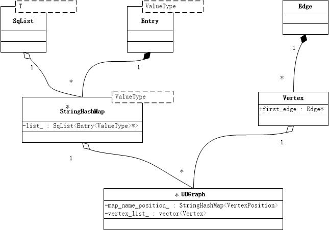
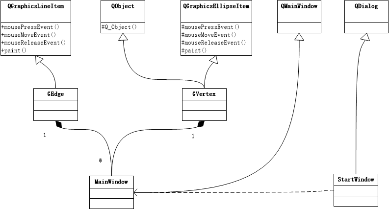

README
===========================
该文件用来给课设组员提供编程时的参考与向导

****

|Author|赵xx|朱xx|陈xx
|---|---|---|---
|E-mail|1224306181@qq.com|810485796@qq.com|1595881193@qq.com

****

## 目录
* [设计](#设计) 
    * 主要数据结构
        *  类依赖
        *  类API
    * GUI
        *  外观设计
        *  GUI类
        *  GUI类API
* [分工](#分工)
* [风格约定](#风格约定)

****

## 设计
主要数据结构(非GUI)， GUI外观设计， GUI类
### 主要数据结构
包括核心 邻接表&&tarjan 辅助 hash_map 线性表
#### 类依赖

#### 类API
邻接表 by 赵元琪
```c++
class UDGraph{
public:
bool is_exist_vertex(std::string name);
int IsExistEdge(std::string &vertex_name_1, std::string &vertex_name_2);
int InsertVertex(std::string new_vertex_name);
void DeleteVertex(std::string delete_vertex_name);
void DeleteEdge(std::string vertex_name_1, std::string vertex_name_2, int num_delete);
Edge *InsertEdge(std::string vertex_name_1, std::string vertex_name_2);
VertexPosition Pos(std::string vertex_name);
// file
void CreateFromFile(std::string file_name);
void SaveAsFile(std::string file_name);
// reload
VertexPosition operator [] (std::string &vertex_name);
std::string operator [] (VertexPosition pos);
//
size_t num_vex();
size_t num_edge();
};
```

dfs类(邻接表友元类) by 赵元琪
```c++
class DfsTarjan{
void SetGraph(UDGraph &graph);
int GetTraOrder();
void Make();
string CutVertex();
string CutEdge();
};
```

字符串哈希表(只支持key为std::string字符串) by 陈毅凯
```c++
class StringHashMap{
public:
unsigned int StringHashCode(const std::string &s);
void put(std::string key, const ValueType &value);
ValueType get(std::string key);
bool is_exist(std::string key);
bool erase(std::string key);
ValueType &operator [] (std::string key);
};
```

线性表 by 朱铭昆
```c++
class SqList{
public:
void push(T x);
void pop();
void erase(size_t pos);
int length();
void reserve(size_t size);
T& operator [](int i);
void operator= (const SqList<T> &list)
};
```
tarjan辅助类 by 朱铭昆
```c++
class DfsTarjanFuZhu{
void Set(int num);
void destroy();
VertexPosition First();
void Delete(VertexPosition position);
};
```

### GUI
#### 外观设计
外观设计主要使用demo设计软件Axure rp
#### GUI类依赖

#### GUI类API
## 分工
|赵元琪|朱明昆|陈毅凯
|---|---|---
|邻接表、dfs类、GUI|线性表、dfs辅助类|字符串哈希表
## 风格约定
代码的风格主要参考于 [Google 开源项目风格指南](http://zh-google-styleguide.readthedocs.io/en/latest/google-cpp-styleguide/naming/)
#### 普通变量命名
小写，下划线相连
```c++
int table_name;
```
#### 类内变量命名
结尾接下划线, 其他与普通变量一样
```c++
class ClassName{
private:
 int table_name_;
};
```
#### 结构体变量命名
与普通变量一样，结尾不接下划线
```c++
struct StructName{
 int table_name;
};
```
